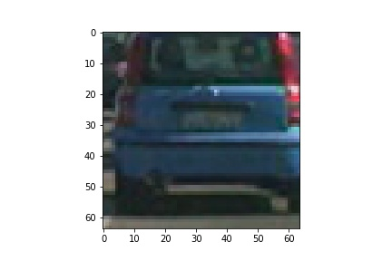

**Vehicle Detection Project**

[//]: # (Image References)
[image1]: ./pipeline_images/not_car_example.jpg
[image2]: ./pipeline_images/car_example.jpg
[image3]: ./examples/HOG_example.jpg
[image4]: ./pipeline_images/example_hog.jpg

[video1]: ./project_video.mp4

Using computer vision techniques and a sliding window approach to detect vehicles in a video stream. The code for this project is contained in the IPython notebook VehicleTracking.ipynb.

### 1. Training Data

The data I used for this project was provided by Udacity and included images from the GTI and also images extracted from the KITTI data set. The data is loaded in the first cell of the IPython notebook.

I started by reading in all the `vehicle` and `non-vehicle` images.  Here is an example of one of each of the `vehicle` and `non-vehicle` classes:

![alt text][image2] ![alt text][image1]

### 2. Feature Extraction

Although in the past I've used convolutional neural networks to classify traffic signs and in similar situations to get a better understanding of traditional computer vision techniques I used feature extraction techniques such as Histogram Oriented Gradients (HOG) color space conversions and color histograms. 

#### Histogram Oriented Gradients
Histogram Oriented Gradients is a method that essentially takes a variable number of pixels in a cell, for example 8x8 and computes the direction of the gradient for each pixel within that cell, or in other words to what side of the pixel is the pixel intensity increasing. For that 8x8 cell a histogram is computed of all these gradients and we the peak of the histogram is taken as the orient direction

Here is an example using the green channel with HOG parameters of `orientations=12`, `pixels_per_cell=(8, 8)` and `cells_per_block=(2, 2)`:

 

![alt text][image2]

####2. Explain how you settled on your final choice of HOG parameters.

I tried various combinations of parameters and...

####3. Describe how (and identify where in your code) you trained a classifier using your selected HOG features (and color features if you used them).

I trained a linear SVM using...

###Sliding Window Search

####1. Describe how (and identify where in your code) you implemented a sliding window search.  How did you decide what scales to search and how much to overlap windows?

I decided to search random window positions at random scales all over the image and came up with this (ok just kidding I didn't actually ;):

![alt text][image3]

####2. Show some examples of test images to demonstrate how your pipeline is working.  What did you do to optimize the performance of your classifier?

Ultimately I searched on two scales using YCrCb 3-channel HOG features plus spatially binned color and histograms of color in the feature vector, which provided a nice result.  Here are some example images:

![alt text][image4]
---

### Video Implementation

####1. Provide a link to your final video output.  Your pipeline should perform reasonably well on the entire project video (somewhat wobbly or unstable bounding boxes are ok as long as you are identifying the vehicles most of the time with minimal false positives.)
Here's a [link to my video result](./project_video.mp4)

####2. Describe how (and identify where in your code) you implemented some kind of filter for false positives and some method for combining overlapping bounding boxes.

I recorded the positions of positive detections in each frame of the video.  From the positive detections I created a heatmap and then thresholded that map to identify vehicle positions.  I then used `scipy.ndimage.measurements.label()` to identify individual blobs in the heatmap.  I then assumed each blob corresponded to a vehicle.  I constructed bounding boxes to cover the area of each blob detected.  

Here's an example result showing the heatmap from a series of frames of video, the result of `scipy.ndimage.measurements.label()` and the bounding boxes then overlaid on the last frame of video:

### Here are six frames and their corresponding heatmaps:

![alt text][image5]

### Here is the output of `scipy.ndimage.measurements.label()` on the integrated heatmap from all six frames:
![alt text][image6]

### Here the resulting bounding boxes are drawn onto the last frame in the series:
![alt text][image7]

---

###Discussion

####1. Briefly discuss any problems / issues you faced in your implementation of this project.  Where will your pipeline likely fail?  What could you do to make it more robust?

Here I'll talk about the approach I took, what techniques I used, what worked and why, where the pipeline might fail and how I might improve it if I were going to pursue this project further.  
